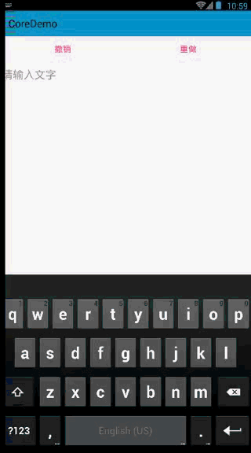
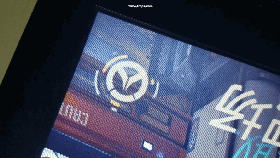
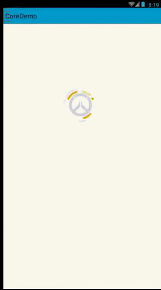
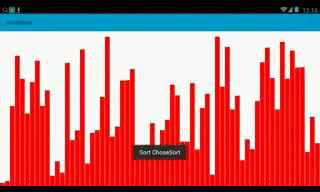
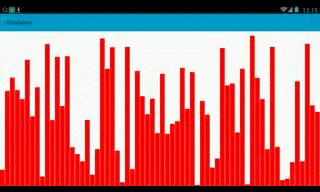
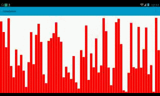

# CoreDemo

如你所见，这是鄙人闲暇之余写的小小Demo，用于积累，用于记录好奇心。虽然大部分都是稀奇古怪似乎派不上用场的东西，但是看着自己的代码动了起来还是十分有趣的。

每写一个Demo我都会尽量详细地记录下实现的步骤，如果你能够在其中找到些许乐趣，那便是鄙人无上的光荣了。

当然，**如果能给我个小小的star的话，那也是极好的！**

## 基于EditText实现撤销重做机制

具体内容请参阅博客：
[Android：基于EditText实现撤销和重做机制](http://blog.csdn.net/DrkCore/article/details/53440392)

## 竜人の剣を喰え
守望先锋作为当下最有火爆的射击游戏之一为我们带了一波网络用语的节奏，你要是不会一句 ***“溜金哇开呀酷裂”*** 都不好意思说自己玩过屁股。

作为Android狗笔者最近想写个Loading界面掌握一些新姿势，索性实现一下守望先锋游戏界面的加载图吧。

原版效果如下：

该截图具有治疗颈椎病的效果，所以请不要在意这5毛画质。

只要你还没有把高中数学全部还给老师的话花点时间都做得出来，效果如下:

具体实现可参阅博客：

[Android：Loading动画——竜人の剣を喰え](http://blog.csdn.net/drkcore/article/details/52664088)

## 自绘动画实践——以Tencent OS录音机波形为例
效果图如下：

想法来源自腾讯Bugly的一篇博文：

[《Android自绘动画实现与优化实战——以Tencent OS录音机波形动画为实例》](http://mp.weixin.qq.com/s?__biz=MzA3NTYzODYzMg==&mid=2653577211&idx=1&sn=2619c7df79f675e45e87891b7eb17669&scene=4#wechat_redirect)

大概的做法就是继承自SurfaceView，以时间作为偏移量不断地绘制正弦曲线，随着SurfaceView刷新和偏移量的变化就能形成动画效果。

具体的实现方法可以查看我的博客：

[Android：自绘动画实践——以Tencent OS录音机波形为例](http://blog.csdn.net/drkcore/article/details/51822818)

## 排序算法的可视化
大部分开发者在踏入程序这条不归路后都有亲手打一遍各种排序的经历，如果说代码是一种信仰的话那这无疑就是我们的朝圣了。鄙人也差不多到这时候了，但好歹作为一名Android开发者多少也要弄得稍微能看一点比较好吧，于是就有这个Demo。

### 最简单的选择排序

### 说好的冒泡排序

### 插入排序

GIF看起来比较慢主要是为了演示效果，实际上各种排序的都是瞬间完成的，最后记录每一次变化交由自定义View来显示而已。

由于暂时没时间，其他排序都还在锅里……
